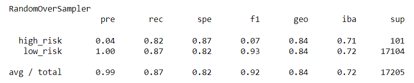
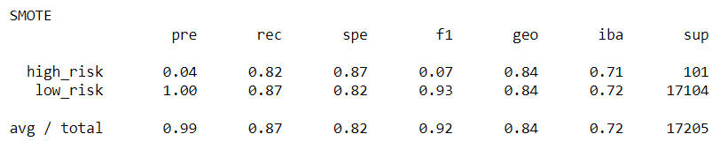
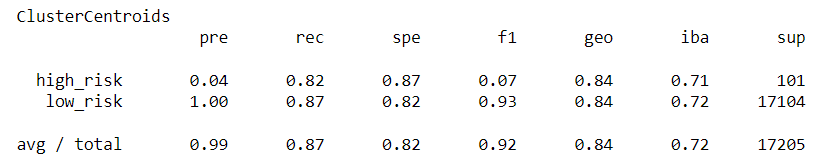
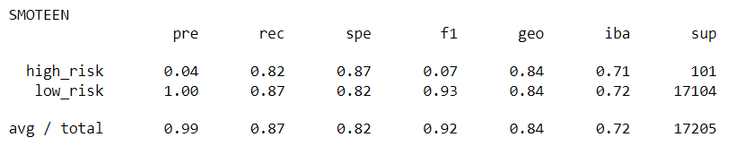
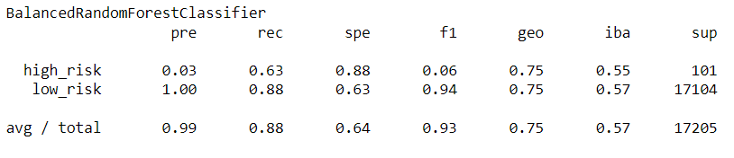
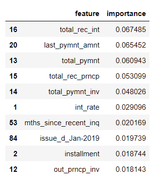
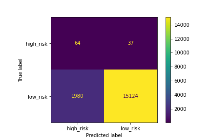
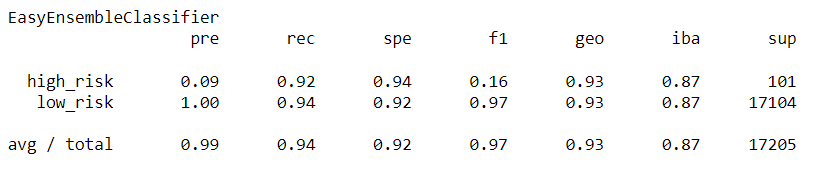

# Credit_Risk_Analysis

## Deliverables/ Analysis

* Deliverable 1: Use Resampling Models to Predict Credit Risk
* Deliverable 2: Use the SMOTEENN Algorithm to Predict Credit Risk
* Deliverable 3: Use Ensemble Classifiers to Predict Credit Risk
* Deliverable 4: A Written Report on the Credit Risk Analysis (README.md)

### Deliverable 1: Use Resampling Models to Predict Credit Risk
* For all three algorithms, the following have been completed:
    - An accuracy score for the model is calculated 
    - A confusion matrix has been generated 
    - An imbalanced classification report has been generated 

  **RandomOverSampler**
    - An accuracy score for the model is calculated as 0.8325
    - A confusion matrix has been generated  
    
    - An imbalanced classification report has been generated 
     

 **SMOTE**  
- An accuracy score for the model is calculated as 0.8441  
 - A confusion matrix has been generated  
     
- An imbalanced classification report has been generated  
    

 **ClusterCentroids** 
- An accuracy score for the model is calculated as 0.8441 
 - A confusion matrix has been generated  
     
- An imbalanced classification report has been generated  
    

## Deliverable 2: Use the SMOTEENN algorithm to Predict Credit Risk 
The combinatorial SMOTEENN algorithm does the following:

**SMOTEENN**
- An accuracy score for the model is calculated to be 0.8389
- A confusion matrix has been generated  

- An imbalanced classification report has been generated  

## Deliverable 3 Use Ensemble Classifiers to Predict Credit Risk

* The BalancedRandomForestClassifier algorithm does the following:
- An accuracy score for the model is calculated to be 0.759
- A confusion matrix has been generated  

- An imbalanced classification report has been generated  

- The features are sorted in descending order by feature importance 
 

* The EasyEnsembleClassifier algorithm does the following:
    - An accuracy score of the model is calculated to be 0.9319
    - A confusion matrix has been generated  

    - An imbalanced classification report has been generated  

